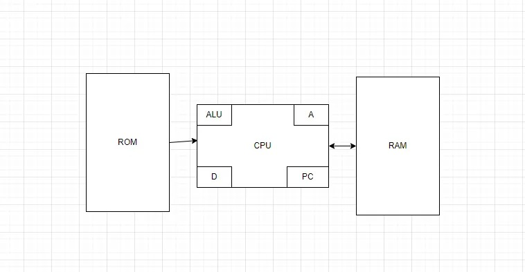

#### Esta es la solucion de mi actividad ✍️
---

#### Componentes principales de la arquitectura Hack

##### CPU: Partes principales
1. **ALU (Unidad Aritmética y Lógica):**  
   - Realiza operaciones matemáticas (suma, resta) y lógicas (AND, OR, NOT).
   - Utiliza los registros A y D para realizar cálculos.

2. **Registro A:**  
   - Se usa para almacenar direcciones de memoria o valores numéricos.
   - Puede actuar como puntero a la memoria.

3. **Registro D:**  
   - Se utiliza para almacenar datos temporales y realizar operaciones en la ALU.
   - No puede almacenar direcciones de memoria.

4. **Contador de Programa (PC):**  
   - Guarda la dirección de la próxima instrucción a ejecutar.
   - Se incrementa automáticamente en cada ciclo, salvo que haya un salto.

---

##### Memoria: Organización en el computador Hack
1. **RAM (Memoria de Acceso Aleatorio):**  
   - Comienza en la dirección `0` y se usa para almacenar datos y variables.  
   - Contiene regiones especiales como:
     - `SCREEN` (16384-24575): Controla la pantalla pixel por pixel.
     - `KBD` (24576): Contiene el valor de la última tecla presionada.

2. **ROM (Memoria de Solo Lectura):**  
   - Contiene el programa en lenguaje máquina que se ejecutará.
   - Las instrucciones comienzan en la dirección `0` y no pueden modificarse en tiempo de ejecución.

3. **Mapa de Memoria:**  
   - Esquema que representa cómo se asignan las direcciones en la RAM y ROM.
   - Permite identificar qué parte de la memoria está dedicada a variables, pantalla, teclado y código ejecutable.

---

##### Diferencias entre los Registros A y D
| Registro | Función |
|----------|---------|
| **A**    | Almacena direcciones o valores numéricos. Puede apuntar a posiciones de memoria. |
| **D**    | Almacena datos temporales. Se usa para cálculos en la ALU, pero no puede contener direcciones. |

**Ejemplo:**
```assembly
@10   // Carga la dirección 10 en A
D=M   // Copia el valor de la dirección 10 en D

