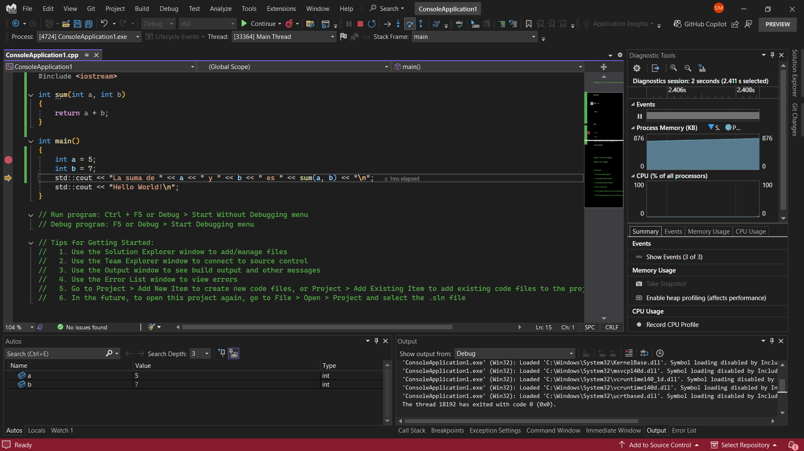

#### Esta es la solucion de mi actividad ✍️
---

1. Se define la función `suma(int a, int b)`, que retorna `a + b`.
2. En `main()`, se declaran `a = 5` y `b = 7`.
3. `cout` imprime el mensaje `"La suma de 5 y 7 es 12"`, llamando a `suma(a, b)`.

#### Opciones de depuración

- Breakpoint

    Se coloca en una línea para pausar la ejecución antes de ejecutarla.

    **Ejemplo:** Si ponemos un breakpoint en cout, podemos verificar el valor de a y b antes de imprimir.
- Step Over

    Ejecuta la siguiente línea de código sin entrar en funciones.

    **Ejemplo:** Si estamos en cout << suma(a, b);, ejecuta la línea sin entrar en suma().
- Step Into

    Permite entrar a una función llamada en la línea actual.

    **Ejemplo:** Si estamos en cout << suma(a, b);, al hacer Step Into, entramos a suma().
- Step Out

    Útil cuando estamos dentro de una función y queremos regresar al código que la llamó.

    **Ejemplo:** Si estamos dentro de suma(), usar Step Out nos lleva de vuelta a main().
- Output

    Permite ver los valores de variables mientras el programa se ejecuta.
    
    **Ejemplo:** Podemos observar cómo a, b y resultado cambian en memoria.