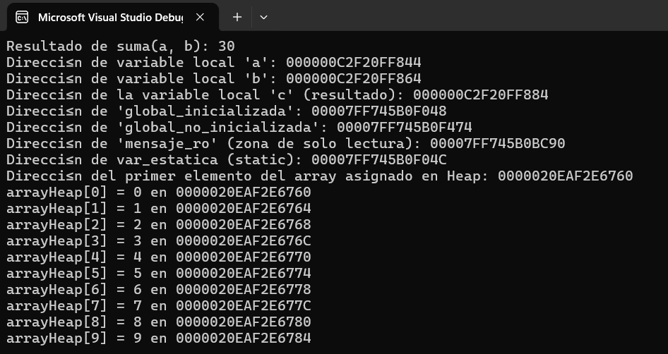

#### Esta es la solucion de mi actividad ✍️
---

#### **Mapa**

```
+------------------------------+
| Segmento de código           |
| suma(), crearArrayHeap(),    |
| funcionConStatic(), main()   |
| (las direcciones las verás   |
| con el depurador)            |
+------------------------------+
| mensaje_ro (solo lectura):   |
| 00007FF745B0BC90             |
+------------------------------+
| global_inicializada:         |
| 00007FF745B0F048             |
| global_no_inicializada:      |
| 00007FF745B0F474             |
| var_estatica (static):       |
| 00007FF745B0F04C             |
+------------------------------+
| Heap                         |
| arrayHeap: 0000020EAF2E6760  |
+------------------------------+
| Stack                        |
| c: 000000C2F20FF884          |
| b: 000000C2F20FF864          |
| a: 000000C2F20FF844          |
+------------------------------+
```

