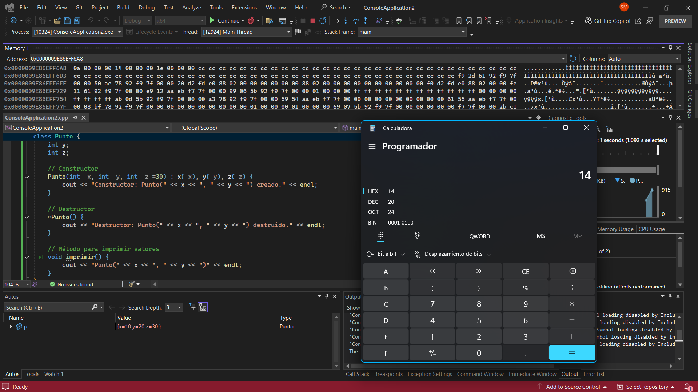

#### Esta es la solucion de mi actividad ✍️
---

- ¿Qué valor en decimal obtienes al escribir 0a en la calculadora en modo hexadecimal?

    El valor en decimal de 0a es 10.

- ¿Qué valor en decimal obtienes al escribir 14 en la calculadora en modo hexadecimal?

    El valor en decimal de 14 es 20.

- ¿Qué observas en la representación de la memoria?
    
    Se observa que los valores se almacenan en orden little-endian, es decir, el byte menos significativo se guarda en la dirección de memoria más baja.

- Si la arquitectura fuera big-endian, ¿cómo quedarían almacenados los bytes en la memoria de p?
    
    En una arquitectura big-endian, los bytes se almacenarían en el orden inverso, es decir, primero el byte más significativo y luego el menos significativo.

- ¿Cuál es la diferencia entre un constructor y un destructor en C++?
    
    El constructor es un método especial que se ejecuta automáticamente cuando se crea un objeto, inicializando sus valores. En contraste, el destructor es un método que se ejecuta automáticamente cuando un objeto sale del alcance, liberando recursos si es necesario.

- ¿Cuál es la diferencia entre un objeto y una clase en C++?
    
    Una clase es una plantilla o modelo que define atributos y métodos. Un objeto es una instancia de esa clase con valores específicos almacenados en memoria.

- ¿Qué diferencia notas entre el objeto Punto en C++ y C#?
    
    En C++, el objeto Punto se almacena en la memoria stack y se maneja de manera directa. En C#, Punto se almacena en el heap y se accede mediante una referencia.

    - ¿Qué es p en C++ y qué es p en C#?

        - En C++, p es un objeto almacenado en la pila (stack).
        - En C#, p es una referencia a un objeto almacenado en el heap.

    - ¿En qué parte de memoria se almacena p en C++ y en C#?

        - En C++, p se almacena en la pila (stack), ya que es una variable local.
        - En C#, p es una referencia en la stack, pero el objeto real se almacena en el heap.

- Captura de pantalla del depurador mostrando la variable p y su dirección de memoria.

    

- ¿Qué observaste con el depurador acerca de p? Según lo que observaste, ¿qué es un objeto en C++?
    
    Al usar el depurador, observamos que p tiene una dirección de memoria fija y contiene directamente los valores x e y. Esto confirma que en C++, un objeto es una entidad en memoria con su propia dirección y contenido.

**Conclusión:**

Este experimento demuestra la diferencia en la administración de memoria entre C++ y C#, resaltando la gestión de memoria en el stack para variables locales en C++ y el uso del heap en C#. El uso del depurador es clave para entender cómo se almacenan y acceden los objetos en diferentes lenguajes de programación.

