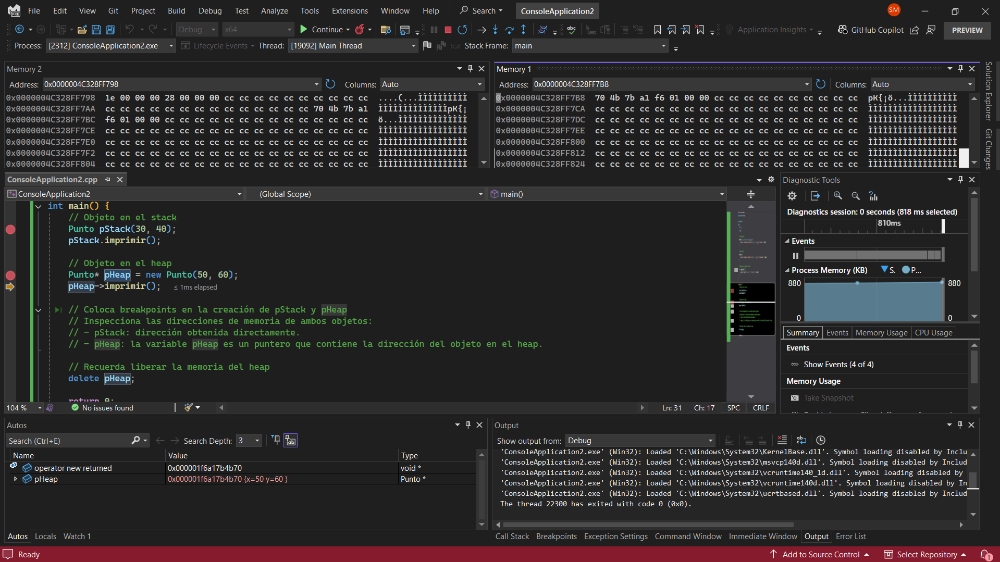

#### Esta es la solucion de mi actividad ✍️
---

1. **Explicación de la diferencia entre objetos creados en el stack y en el heap**

- En C++, los objetos pueden ser creados en dos regiones de memoria principales:

    - **Stack (pila):**
        Los objetos creados en el stack tienen una vida limitada al ámbito en el que fueron declarados.
        Se gestionan automáticamente: cuando la función en la que se crearon finaliza, la memoria es liberada automáticamente.
        La asignación y liberación de memoria en el stack es rápida.

    - **Heap (montículo):**
        Los objetos creados en el heap tienen una vida más flexible, ya que persisten hasta que se liberen manualmente con delete.
        La asignación de memoria en el heap es más lenta en comparación con el stack.
        Es necesario liberar la memoria explícitamente para evitar fugas de memoria.

2. **Análisis de los objetos en el código**

- **`pStack`:**
    pStack es un objeto de la clase `Punto` creado en el stack.
    Se almacena directamente en la memoria de la pila y su dirección de memoria puede consultarse con `&pStack`.
    Se libera automáticamente cuando main() termina.

- **`pHeap`:**
    pHeap es un puntero que almacena la dirección de un objeto `Punto` creado dinámicamente en el heap usando `new`.
    No es un objeto en sí, sino una referencia a un objeto en el heap.
    Para acceder a sus miembros, se usa `->` en lugar de `..`
    Es necesario liberar su memoria con `delete pHeap;` para evitar fugas de memoria.

3. **Observaciones en Memory1**

- **Dirección de `&pHeap` en Memory1:**
    Muestra la dirección de memoria donde se almacena el puntero `pHeap` en el stack.
    Contiene la dirección de memoria del objeto Punto en el heap.

- **Contenido de `pHeap` en la pestaña Locals:**
    Muestra los valores de x y y almacenados en la dirección de memoria a la que apunta pHeap.