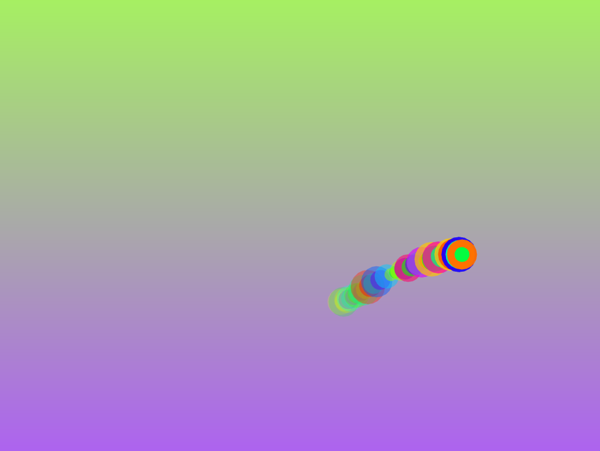
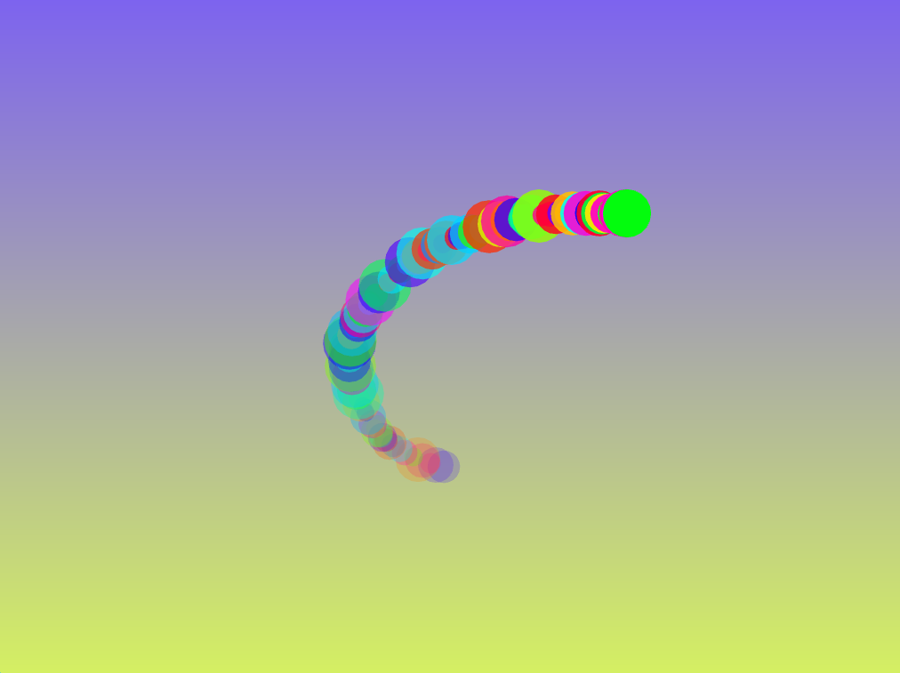
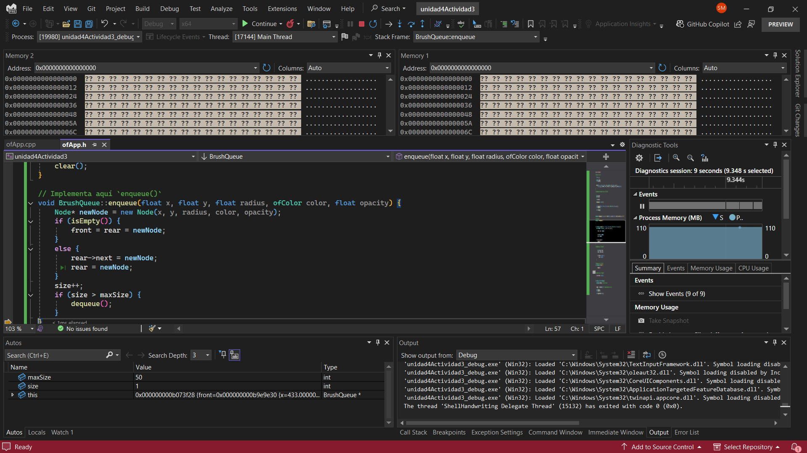

#### Esta es la solucion de mi actividad ✍️
---

#### **ofApp.h**
``` cpp
#pragma once
#include "ofMain.h"

// Nodo de la cola
struct Node {
    float x, y;
    float radius;
    ofColor color;
    float opacity;
    Node* next;

    Node(float _x, float _y, float _radius, ofColor _color, float _opacity)
        : x(_x), y(_y), radius(_radius), color(_color), opacity(_opacity), next(nullptr) {
    }
};

// Implementación manual de una cola (FIFO)
class BrushQueue {
public:
    Node* front;
    Node* rear;
    int size;
    int maxSize;

    BrushQueue(int _maxSize);
    ~BrushQueue();

    void enqueue(float x, float y, float radius, ofColor color, float opacity);
    void dequeue();
    void clear();
    bool isEmpty();
};


// Constructor
BrushQueue::BrushQueue(int _maxSize) : front(nullptr), rear(nullptr), size(0), maxSize(_maxSize) {}

// Destructor
BrushQueue::~BrushQueue() {
    clear();
}

// Implementa aquí `enqueue()`
void BrushQueue::enqueue(float x, float y, float radius, ofColor color, float opacity) {
    Node* newNode = new Node(x, y, radius, color, opacity);
    if (isEmpty()) {
        front = rear = newNode;
    }
    else {
        rear->next = newNode;
        rear = newNode;
    }
    size++;
    if (size > maxSize) {
        dequeue();
    }
}

// Implementa aquí `dequeue()`
void BrushQueue::dequeue() {
    if (!isEmpty()) {
        Node* temp = front;
        front = front->next;
        delete temp;
        size--;
        if (front == nullptr) {
            rear = nullptr;
        }
    }
}

// Implementa aquí `clear()`
void BrushQueue::clear() {
    while (!isEmpty()) {
        dequeue();
    }
}

// Implementa aquí `isEmpty()`
bool BrushQueue::isEmpty() {
    return front == nullptr;
}


class ofApp : public ofBaseApp {
public:
    BrushQueue strokes; // Cola de trazos
    float backgroundHue = 0;

    ofApp() : strokes(50) {} // Tamaño máximo de la cola

    void setup();
    void update();
    void draw();
    void keyPressed(int key);
};
```

#### **ofApp.cpp**
``` cpp
#include "ofApp.h"

//--------------------------------------------------------------
void ofApp::setup() {
    ofBackground(0);
}

//--------------------------------------------------------------
void ofApp::update() {
    backgroundHue += 0.2;
    if (backgroundHue > 255) backgroundHue = 0;

    if (ofGetMousePressed()) {
        float x = ofGetMouseX();
        float y = ofGetMouseY();
        float radius = ofRandom(10, 30);
        ofColor color = ofColor::fromHsb(ofRandom(255), 255, 255);
        float opacity = 255;
        strokes.enqueue(x, y, radius, color, opacity);
    }
}

//--------------------------------------------------------------
void ofApp::draw() {
    // Fondo con gradiente dinámico
    ofColor color1, color2;
    color1.setHsb(backgroundHue, 150, 240);
    color2.setHsb(fmod(backgroundHue + 128, 255), 150, 240);
    ofBackgroundGradient(color1, color2, OF_GRADIENT_LINEAR);

    Node* current = strokes.front;
    int i = 0;
    while (current != nullptr) {
        float mappedOpacity = ofMap(i, 0, strokes.maxSize, 50, 255);
        ofSetColor(current->color, mappedOpacity);
        ofDrawCircle(current->x, current->y, current->radius);
        current = current->next;
        i++;
    }
}

//--------------------------------------------------------------
void ofApp::keyPressed(int key) {
    if (key == 'c') {
        strokes.clear();
    }
    if (key == 'a') {
        strokes.clear();
        strokes.maxSize = (strokes.maxSize == 50) ? 100 : 50;
    }
    else if (key == 's') {
        ofSaveScreen("screenshot_" + ofToString(ofGetFrameNum()) + ".png");
    }
}
```



#### **Depuración**

**Herramientas usadas:**
- Puntos de interrupción en enqueue, dequeue, y clear
- Ventana de variables locales e inspección de memoria

**Pasos realizados:**
- Coloqué un breakpoint en enqueue() y confirmé que los nodos se añadían correctamente, revisando front, rear, y size.
- Observé que dequeue() eliminaba el primer nodo correctamente cuando se alcanzaba maxSize.
- Confirmé en la depuración que clear() dejaba ambos punteros (front, rear) en nullptr y size en 0.
- Revisé el mapa de memoria para asegurar que no quedaban nodos huérfanos.



#### **Lista de Pruebas Realizadas**

| Prueba | Descripción | Resultado Esperado | Resultado Obtenido |
|--------|-------------|--------------------|--------------------|
| Enqueue simple | Agregar un trazo con enqueue() | Trazo visible en pantalla | Se dibuja correctamente |
|Límite FIFO | Insertar 51 trazos con maxSize = 50 | El primero debe desaparecer | El nodo más antiguo se eliminó|
|Limpieza con 'c' | Presionar ‘c’ | Todos los nodos se borran | Pantalla vacía|
|Cambio de tamaño con 'a' | Presionar ‘a’ | Alterna entre 50 y 100 | Funciona como se esperaba|
|Guardar imagen con 's' | Presionar ‘s’ | Se guarda captura | Captura guardada correctamente|
