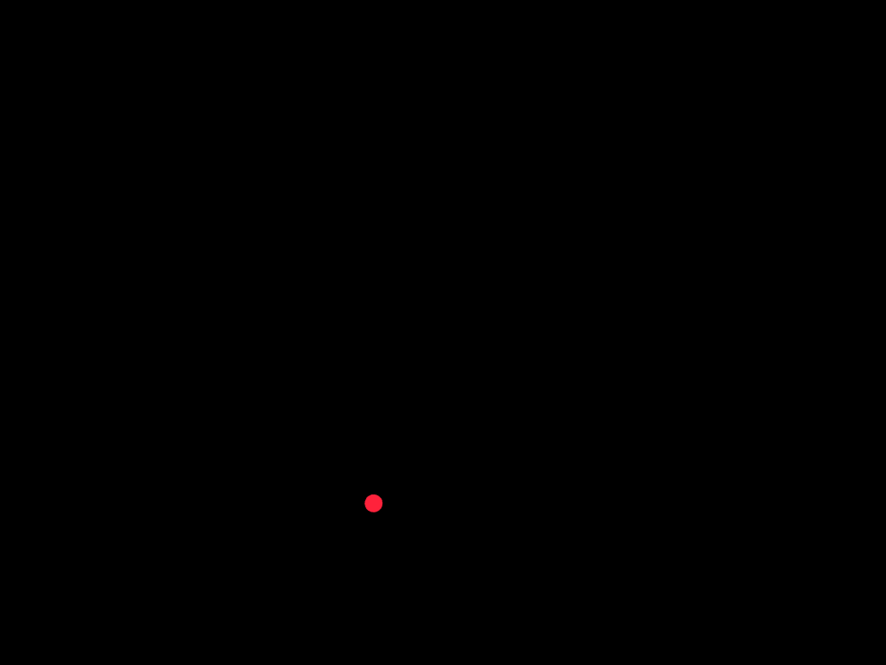
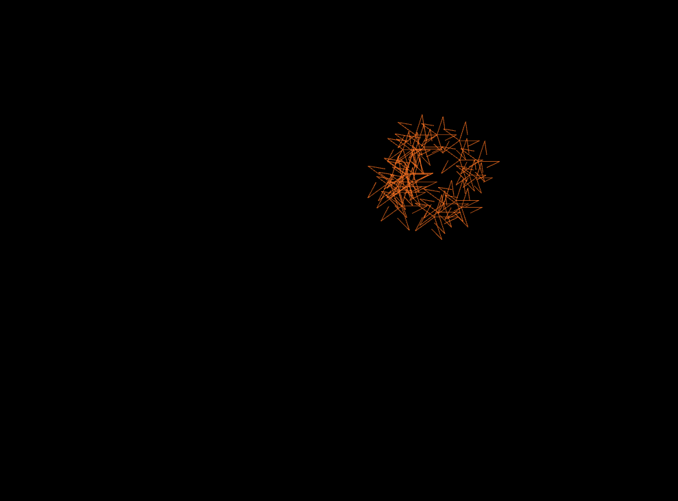
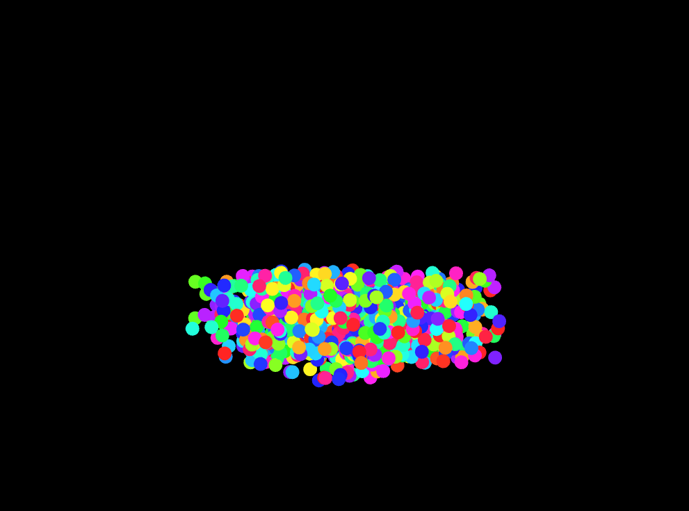
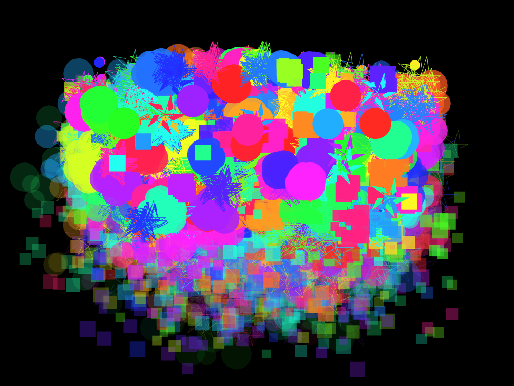

#### Esta es la solucion de mi actividad ✍️
---

#### **Mi Análisis:**
**Diseño del programa:**

- **`Particle`** es una clase abstracta base. Define una interfaz común para todas las partículas.

- **Las clases derivadas son:**

    - **`RisingParticle`:** sube desde la parte inferior y explota.

    - **`ExplosionParticle`:** clase intermedia de la que heredan tres tipos:

        - **`CircularExplosion`**

        - **`RandomExplosion`**

        - **`StarExplosion`**

        Cada una sobrescribe los métodos `update()` y `draw()` para mostrar un comportamiento distinto, demostrando polimorfismo.

#### **Experimentación:**
Al correr la aplicación en openFrameworks

- Se generan partículas con `createRisingParticle()`

    ``` cpp
    void ofApp::mousePressed(int x, int y, int button) {
        createRisingParticle();
    }
    ```
    

- Estas partículas suben y, al llegar a cierto punto o tras cierto tiempo, explotan.

    

- La explosión genera múltiples partículas de uno de tres tipos aleatorios.

#### **Que deduje:**

- Se utiliza herencia para extender la clase `Particle` y especializar comportamientos.

- El polimorfismo permite actualizar y dibujar partículas sin saber su tipo específico en tiempo de compilación.

- El encapsulamiento protege la lógica de movimiento y vida útil dentro de cada clase.

#### **Observaciones del comportamiento:**

- Las partículas `RisingParticle` explotan cerca del 15% de la altura de la ventana.

    

- La explosión produce entre 20 y 30 partículas de un tipo aleatorio.

    

- La simulación es fluida y cada tipo de explosión tiene un estilo visual distintivo.
