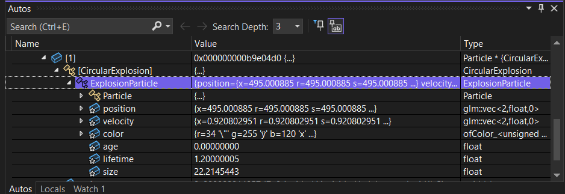

#### Esta es la solucion de mi actividad ✍️
---

#### **Observación del objeto ofApp en memoria**

#### Hipótesis
Antes de ejecutar el código, espero ver que el objeto `ofApp` aparece en memoria como una estructura compleja que contiene una lista de punteros a partículas (`std::vector<Particle*>`). También espero ver sus métodos heredados de `ofBaseApp`.


#### Observaciones y Conclusión
El depurador muestra que `ofApp` contiene internamente un vector de punteros a objetos. Solo está en memoria mientras la aplicación corre, como se esperaba. Podemos ver su estructura interna y acceder a información como el tamaño del vector, punteros internos, etc.

#### **Observación del objeto CircularExplosion**



#### Observaciones y Conclusión
El objeto `CircularExplosion` en memoria incluye campos heredados de `ExplosionParticle` y `Particle`. El depurador permite inspeccionar las jerarquías y cómo se almacenan estos datos en memoria linealmente.

#### **Métodos virtuales y vtable**

#### Observación de la _vtable de CircularExplosion


#### Observación de la _vtable de StarExplosion


#### Comparación y Conclusiones
Ambas tablas de funciones virtuales (_vtable) muestran entradas diferentes según los métodos sobrescritos. Esto permite que el método correcto sea llamado en tiempo de ejecución, aunque el tipo esté almacenado como puntero a la clase base. Esto es clave para el polimorfismo.

#### **Encapsulamiento**

#### Código de ejemplo y resultados
Se probaron dos programas en C++ para demostrar el encapsulamiento:
- El primer programa impide acceder directamente a miembros privados en tiempo de compilación.
- El segundo permite acceder a ellos mediante punteros y `reinterpret_cast` en tiempo de ejecución.

#### Conclusión
El encapsulamiento en C++ se garantiza en tiempo de compilación, pero puede ser violado manualmente en tiempo de ejecución con técnicas avanzadas.

#### ¿Qué es el encapsulamiento?
El encapsulamiento es el mecanismo por el cual se restringe el acceso directo a algunos de los componentes de un objeto. Es importante porque protege la integridad interna del objeto, asegurando que solo métodos definidos puedan modificar su estado.

#### **Herencia**

#### Observaciones
Se puede observar que el objeto ocupa memoria por cada clase de la jerarquía (Particle → ExplosionParticle → CircularExplosion), almacenando sus atributos uno tras otro.

#### ¿Cómo se implementa la herencia en C++?
C++ implementa la herencia almacenando los atributos de las clases base dentro del mismo bloque de memoria del objeto derivado. También crea punteros a las tablas virtuales si hay métodos virtuales.

#### Herencia múltiple
Se realizó un experimento con herencia múltiple. Aquí se muestra cómo el objeto en memoria incluye atributos de múltiples clases base:

```cpp
class A { int a; };
class B { int b; };
class C : public A, public B { int c; };
```

#### **Polimorfismo**

#### Observación del método update() en tiempo de ejecución
Con el depurador se observó que update() se comporta de forma diferente según el tipo de partícula, aunque se accede desde un puntero a Particle.

#### Conclusión
Esto demuestra polimorfismo en tiempo de ejecución: se llama al método correspondiente al tipo real del objeto.

#### Dibujo explicativo del polimorfismo en tiempo de ejecución

