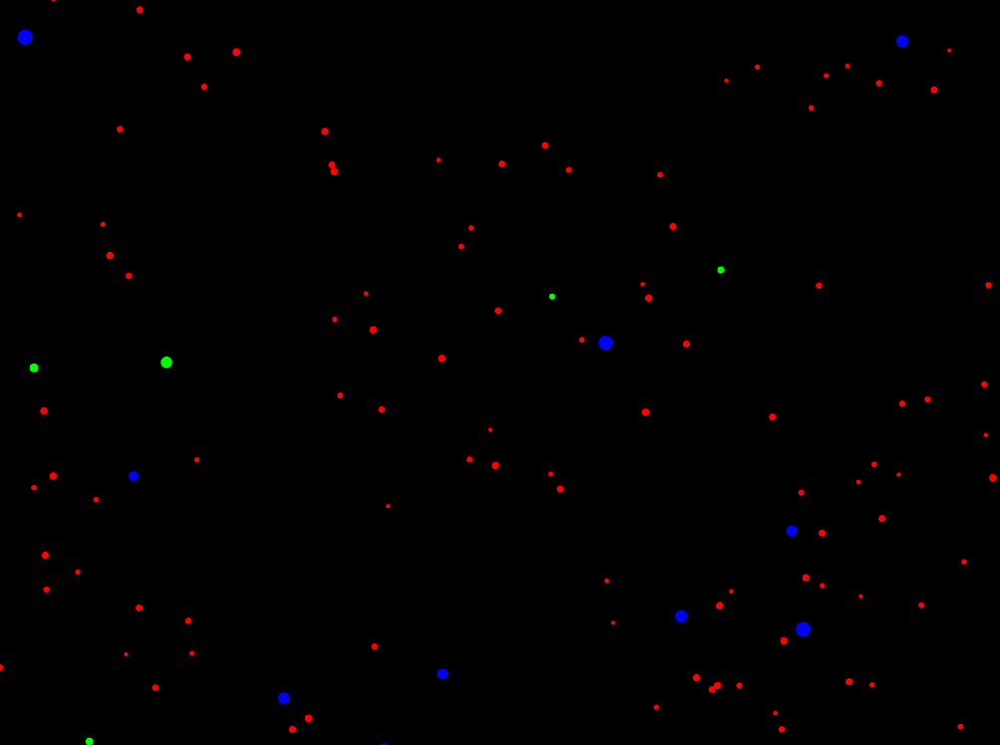
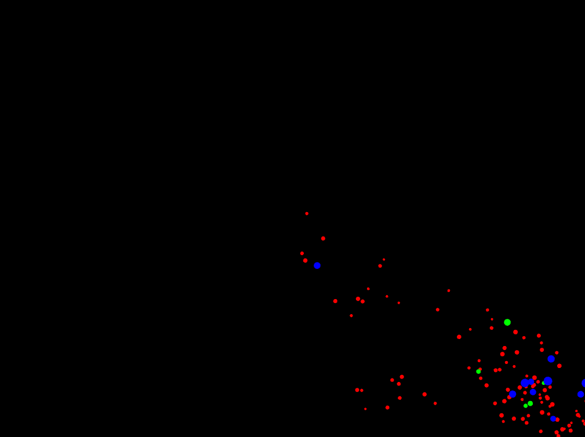
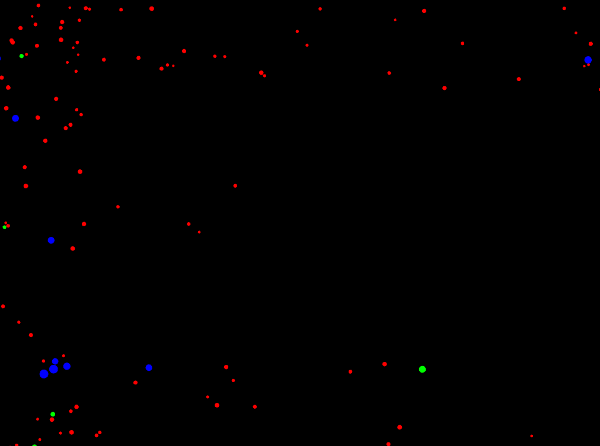
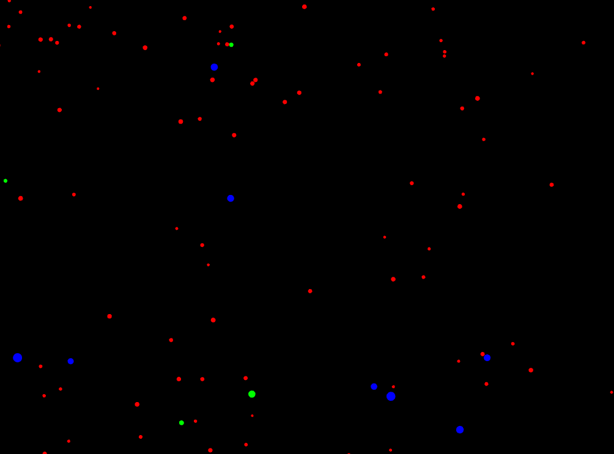
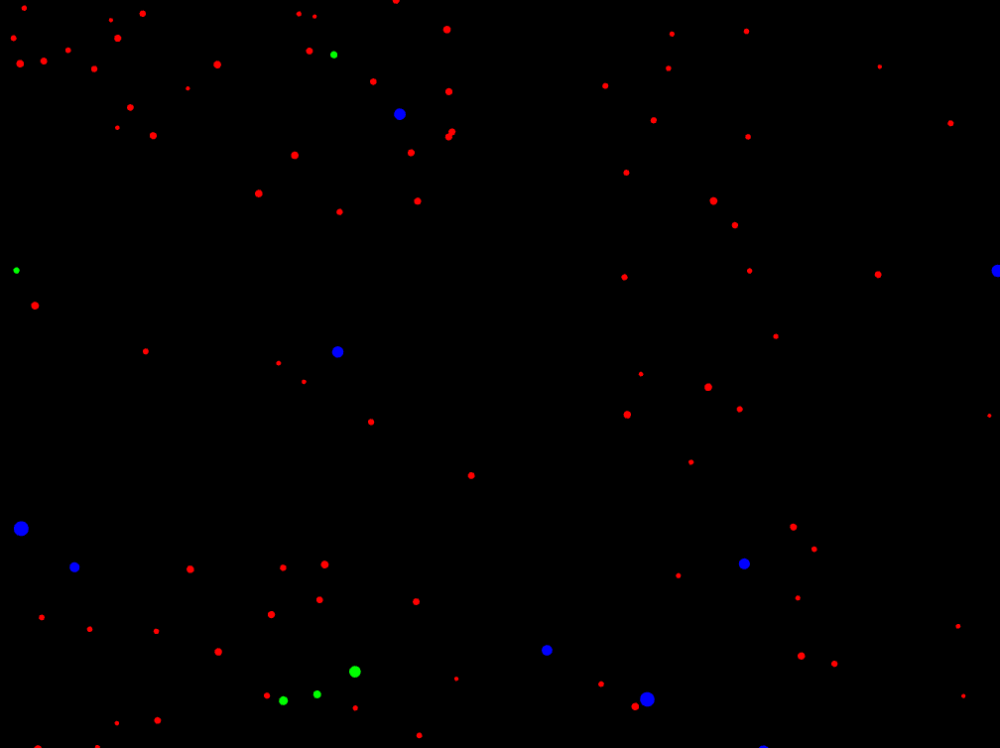

#### Esta es la solucion de mi actividad ✍️
---

#### **1. Comportamiento general de la aplicación**
Al ejecutar la aplicación, aparece una simulación visual donde muchas partículas (puntos o esferas) se mueven de forma autónoma sobre un fondo negro. Las partículas presentan colores distintos, lo que sugiere que existen diferentes tipos. En general, se mueven libremente con trayectorias suaves, rebotando cuando llegan a los bordes de la ventana.

#### **2. Interacción con la aplicación**
Se puede interactuar presionando diferentes teclas:

- **‘a’ (attract):** Las partículas se ven atraídas hacia el cursor del mouse. Cambian su trayectoria y se acercan lentamente al puntero.
- **‘r’ (repel):** Las partículas se alejan del cursor del mouse, como si hubiera una fuerza de repulsión.
- **‘s’ (stop):** Todas las partículas se detienen, dejando de moverse por completo.
- **‘n’ (normal):** Las partículas vuelven a su comportamiento inicial, desplazándose libremente en direcciones aleatorias.

Estas interacciones permiten observar cómo las partículas cambian de estado en tiempo real.

#### **3. Tipos de partículas**
Sí, se observan al menos tres tipos de partículas diferentes, diferenciables por:

- **Color:**
    - Rojas (posiblemente “stars”).
    - Verdes (probablemente “shooting_star”).
    - Azules (aparentan ser “planets”).

- **Tamaño y movimiento:**
    - Algunas partículas son pequeñas y lentas.
    - Otras son más grandes o más rápidas.

Esto indica que, aunque todas son instancias de la clase `Particle`, tienen propiedades distintas según el tipo creado por la fábrica.

#### **4. Capturas de pantalla**

- **Estado inicial:** partículas moviéndose libremente.

- **Después de presionar ‘a’:** partículas se agrupan alrededor del cursor.

- **Después de presionar ‘r’:** partículas se alejan del cursor.

- **Después de presionar ‘s’:** partículas congeladas en su lugar.

- **Después de presionar ‘n’:** partículas vuelven a moverse normalmente.

#### **5. Hipótesis sobre el funcionamiento interno**
Al presionar una tecla, la aplicación probablemente notifica a todas las partículas un evento (`"attract"`, `"repel"`, etc.) mediante el patrón Observer. Cada partícula, al recibir la notificación, cambia su estado interno usando el patrón State, el cual determina su nuevo comportamiento en la función `update()`.

La creación de partículas diferenciadas (colores, tamaños, velocidad) parece gestionada por el patrón Factory, que asigna propiedades específicas según el tipo.