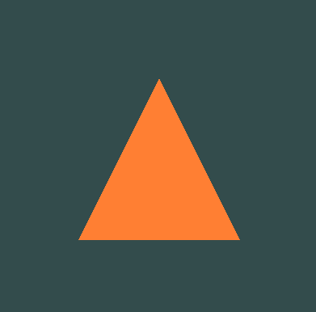

#### Esta es la solucion de mi actividad ✍️
---

#### **Captura de pantalla:**

#### **Observaciones generales:**
Abrí el proyecto descargado desde el repositorio en GitHub y exploré su estructura en Visual Studio. Pude identificar los archivos principales, especialmente el archivo `.cpp` que contiene el código de la aplicación. Compilé y ejecuté el proyecto sin problemas y pude ver el triángulo dibujado en la ventana que se abrió.

#### **Preguntas iniciales para investigar:**
- ¿Cómo interactúan los diferentes archivos y módulos para lograr que el triángulo se dibuje en pantalla? ¿Cuál es el flujo básico desde el inicio del programa hasta la renderización?
- ¿Qué función cumplen los shaders en este proyecto? ¿Cómo se definen y conectan al programa principal?
- ¿Qué son los VBO (Vertex Buffer Objects) y VAO (Vertex Array Objects) que aparecen en el código, y cómo controlan el flujo de datos hacia la GPU?